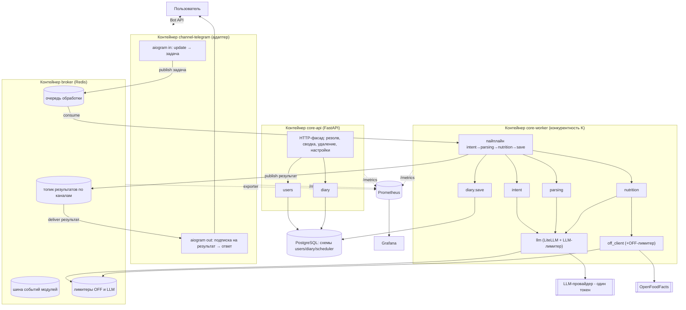
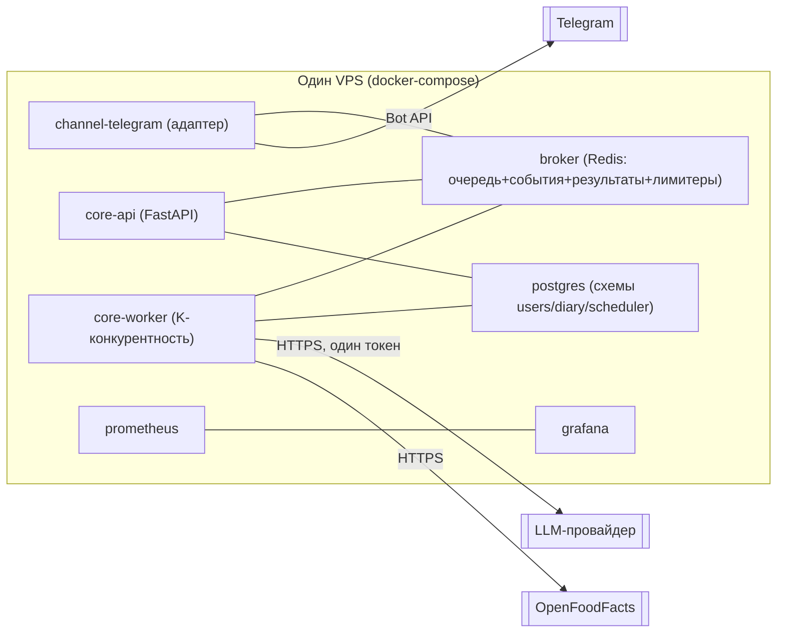

# Архитектура — Calorithm (ЧЕРНОВИК v2 — ЗАМЕНЁН)

> ⚠️ **Заменён чистовиком `docs/architecture.md`.** Этот файл сохранён как история решений и не является источником истины. Все вопросы черновика (A — брокер, B — параллельность, доставка авто-сводки) закрыты; в частности, доставка авто-сводки идёт **только в primary-канал** (ADR-0009), а не «во все активные каналы», как предлагалось в §2.5 ниже.
>
> Статус: **черновик v2, шаг 2 процесса** (`docs/development-workflow.md`), такт «правки черновика по мнению автора».
> Это НЕ чистовик. ADR, конвенции кода и Definition of Done здесь намеренно НЕ пишутся — они идут финальным тактом после того, как автор подтвердит решения по брокеру (A) и параллельности воркера (B).
> Что изменилось относительно v1: автор зафиксировал ряд решений как данность (см. ниже). Документ перестроен под них: очередь обработки сохраняется, ядро и адаптеры — отдельные контейнеры, межмодульное общение через брокер, мониторинг с самого начала. Спор «монолит vs сервисы / очередь vs синхрон» из v1 закрыт в пользу позиции автора.
> Дата: 2026-06-02 · Язык: русский.

---

## Часть 0. Решения автора — данность этого черновика

Ниже зафиксированные решения автора. Они **не оспариваются** и встроены в архитектуру v2. (В v1 по части из них предлагалось обратное — см. «История изменений» в конце.)

| # | Решение автора | Где отражено в v2 |
|---|---|---|
| Д1 | Паттерн очереди обработки сохраняется: приём → очередь → воркер (LLM: парсинг US-002, классификация US-017, оценка КБЖУ US-004). Осознанный выбор в пользу масштабируемости/надёжности. | §2.3, §2.4 |
| Д2 | Ответ с разбором может приходить с задержкой; жёсткого синхронного UX нет. Пользователю — индикация «обрабатываю…», результат доставляется после обработки. Механизм доставки отложенного результата обратно в канал — спроектировать явно. | §2.5 (центральный раздел) |
| Д3 | Ядро и адаптеры каналов — отдельные контейнеры, между ними сетевая граница (HTTP и/или брокер). Адаптер тонкий, знает только свой транспорт. | §2.1, §2.2, §2.7 |
| Д4 | Модульный монолит ядра допустим, но со строгой развязкой: независимость модулей по коду И по схемам БД; «одна схема — один владелец-модуль»; межмодульное общение через брокер, не через общие таблицы. Цель — механический переход на микросервисы. | §2.1, §2.6, §2.10 |
| Д5 | LiteLLM — библиотека внутри сервиса, без отдельного gateway-процесса. | §2.1 (модуль `llm`) |
| Д6 | Глобальный лимитер OFF (US-010) — масштабируемый: общее состояние вне процесса, переживает несколько воркеров. | §2.8 |
| Д7 | Мониторинг Grafana + Prometheus закладываем с самого начала. | §2.9 |
| Д8 | У одного пользователя несколько каналов могут быть активны одновременно. Заложить в модель данных и в логику доставки. | §2.5, §2.11 |

---

## Часть 1. Два решения, по которым нужен детальный анализ (главный результат такта)

### A. Выбор брокера сообщений

**Контекст.** Брокер в v2 несёт двойную нагрузку:
1. **Очередь обработки сообщений** (Д1): входящие задачи на LLM-обработку от адаптеров к воркерам.
2. **Шина межмодульного общения** (Д4): модули ядра общаются событиями через брокер, а не через общие таблицы — это требование развязки.
3. **Доставка отложенного результата** обратно в адаптер канала (Д2).

Автор называл «брокер типа Kafka» и явно ценит масштабируемость и готовность к будущему. Но текущая реальность — **1–2 пользователя, один VPS, один разработчик**.

#### Сравнение кандидатов

| Критерий | **Kafka** (сразу) | **Redis Streams** | **RabbitMQ** | **NATS (+ JetStream)** |
|---|---|---|---|---|
| Семантика доставки | at-least-once, сильный ordering в партиции | at-least-once (consumer groups, `XACK`, PEL) | at-least-once (ack/nack, DLX) | at-least-once с JetStream; core NATS — at-most-once |
| Consumer groups | Да (нативно, ребаланс) | Да (`XREADGROUP`) | Да (competing consumers через очередь) | Да (durable consumers / queue groups) |
| Retention / реплей | Сильная сторона: лог с retention, реплей по offset | Ограничено (`MAXLEN`, по сути обрезаемый лог) | Слабо (очередь, не лог; сообщение уходит после ack) | JetStream: настраиваемый retention, реплей |
| Операционная стоимость | Высокая: ZooKeeper/KRaft, JVM, настройка партиций/retention, память/диск | **Очень низкая**: если Redis уже нужен (лимитеры Д6) — это ноль нового инфраструктурного железа | Средняя: отдельный брокер, Erlang-рантайм, exchange/queue/binding-модель | Средняя: лёгкий бинарь, но JetStream добавляет конфигурацию стораджа |
| Порог входа разработчика | Высокий (концепции партиций, offset, ребаланса, ISR) | **Низкий** (знаком как Redis; модель Streams простая) | Средний (exchange/routing/binding) | Средний (subjects, JetStream API) |
| Лишние процессы на VPS | +1 тяжёлый (Kafka) [+1 если ZK] | **0 новых** при наличии Redis для лимитеров | +1 средний | +1 лёгкий |
| Подходит как шина межмодульных событий (Д4) | Да (topic-per-event), избыточно сейчас | Да (stream-per-event-type) | Да (topic exchange) | Да (subjects, идеально под pub/sub) |
| Готовность к масштабу | Эталон при высоком throughput / многих потребителях | Хватает до заметных нагрузок; партиционирование вручную | Хороша до средних нагрузок | Хороша, ниже эксплуатационная сложность чем Kafka |

#### Рекомендация (A): **Redis Streams сейчас, за интерфейсом-абстракцией очереди; Kafka — отложенное решение, не отменённое**

Две главные причины:

1. **Нулевая дополнительная инфраструктура.** Масштабируемые лимитеры (OFF — Д6, и LLM-лимитер — раздел B) всё равно требуют общего состояния вне процесса, и Redis — естественный, «boring» выбор для них. Если Redis уже в деплое, Redis Streams даёт очередь + consumer groups + at-least-once + ack/PEL **без единого нового процесса**. Kafka добавил бы тяжёлый JVM-компонент (KRaft/ZooKeeper) ради нагрузки 1–2 пользователей — это прямое нарушение «boring tech / start small» без сегодняшней отдачи.

2. **Семантика Redis Streams закрывает все три роли брокера в v2** (очередь задач, шина событий между модулями, топик доставки результатов): consumer groups для конкурентных воркеров, `XACK` + Pending Entries List для at-least-once и повторной доставки при падении воркера, отдельные streams под типы событий. Retention/реплей у Kafka сильнее, но в MVP реплей событий не требуется; когда потребуется (event sourcing, аналитика, много независимых потребителей одного лога) — это и есть триггер миграции на Kafka.

**Это решение НЕ закрывает дверь к Kafka** — наоборот, оно делает переход дешёвым через абстракцию (ниже). Автор получает масштабируемую очередь сегодня и механический путь к Kafka, когда появится реальная причина.

#### Как абстрагировать очередь, чтобы смена брокера не ломала логику

Ключ к «механическому переходу» (Д4) — модули **никогда не импортируют клиент брокера напрямую**. Между логикой и брокером — узкий типизированный порт.

```
Модули ядра  ──►  MessageBus (порт, Protocol)  ──►  RedisStreamsBus (адаптер)
                       ▲                                  KafkaBus (адаптер, позже)
                       │                                  InMemoryBus (адаптер, тесты)
                  типизированные события (Pydantic)
```

Порт (эскиз контракта, не финал):

```python
class MessageBus(Protocol):
    async def publish(self, topic: str, event: Event) -> None: ...
    async def subscribe(
        self, topic: str, group: str, handler: Callable[[Event], Awaitable[None]]
    ) -> None: ...
    # семантика: at-least-once; handler обязан быть идемпотентным;
    # ack — после успешной обработки; при ошибке — повторная доставка
```

- **Контракт фиксирует семантику, а не реализацию**: at-least-once + idempotent handler + явный ack. Это общий знаменатель Redis Streams / Kafka / RabbitMQ — логика, написанная под него, переживёт смену адаптера.
- `topic`/`group` — абстрактные имена; маппинг на stream/consumer-group (Redis) или topic/consumer-group (Kafka) живёт в адаптере.
- Тесты гоняются на `InMemoryBus` — без поднятого брокера.
- **Триггеры миграции на Kafka** (зафиксировать как «когда, а не если»): нужен реплей/долгий retention лога событий; >~единиц тысяч событий/сек устойчиво; несколько независимых команд-потребителей одного потока; требование строгого ordering на больших объёмах.

> Решение автору на подтверждение (A): Redis Streams + порт `MessageBus`. Если автор настаивает на Kafka с первого дня — порт это позволяет, но мы платим операционную стоимость без сегодняшней отдачи; рекомендация — нет.

---

### B. Параллельность воркера при ОДНОМ LLM-токене

**Жёсткое ограничение (автор).** Все запросы к LLM идут под **одним токеном/аккаунтом**. Значит существует **общий на всю систему рейт-лимит провайдера** (RPM/TPM) и общий бюджет стоимости. Перегруз → 429, риск временных банов, всплеск стоимости (R1, R3). Параллелить воркеры «в лоб» нельзя — несколько воркеров под одним токеном суммарно пробьют лимит провайдера.

#### Почему строго-последовательная обработка НЕ обязательна (и вредна при масштабе)

Наивный безопасный вариант — один воркер, обрабатывающий задачи строго по одной. Он гарантирует, что лимит не пробит, но:
- **Узкое место по латентности.** Одно сообщение про еду = несколько LLM-вызовов (классификация US-017 + парсинг US-002 + до N оценок КБЖУ US-004). При строгой последовательности задача пользователя B ждёт полной обработки задачи пользователя A — глубина очереди и время ожидания растут линейно с числом пользователей.
- **Недоиспользование бюджета токена.** Лимит провайдера — это допустимый *throughput* (запросов/мин, токенов/мин), а не «один запрос в полёте». Пока один вызов ждёт ответа сети (секунды I/O), токен простаивает, хотя провайдер разрешил бы ещё запросы в этом окне.

Вывод: **ограничивать нужно не число воркеров, а суммарный темп LLM-вызовов** — он обязан укладываться в бюджет одного токена. Параллельность допустима ровно настолько, насколько её разрешает лимит провайдера.

#### Модель обработки (рекомендация B)

Разделяем два разных ограничителя — это ключевой момент:

1. **Параллельность воркера** (сколько задач *в обработке* одновременно) — управляет утилизацией CPU/event-loop и глубиной очереди.
2. **Централизованный LLM-лимитер** (сколько *LLM-вызовов* в окне) — единственный страж бюджета токена, общий на ВСЕ воркеры и процессы.

```
                       ┌─────────────────────────────────────────┐
                       │   Redis: централизованный LLM-лимитер     │
                       │   (token-bucket по RPM и TPM единого      │
                       │    токена; общее состояние)               │
                       └───────────────▲───────────────▲──────────┘
                                       │ acquire()      │ acquire()
                 ┌─────────────────────┴───┐   ┌────────┴────────────────┐
   очередь ───►  │ worker #1 (asyncio,      │   │ worker #2 (asyncio,      │
   (Redis        │ конкурентность задач =K) │   │ конкурентность задач =K) │
   Streams,      └──────────────────────────┘   └──────────────────────────┘
   consumer            каждый LLM-вызов проходит через лимитер ↑
   group)
```

- **LLM-лимитер живёт в Redis** (там же, где лимитер OFF — Д6), реализован как **token-bucket** по двум осям: RPM (запросов/мин) и TPM (токенов/мин) единственного токена. КАЖДЫЙ LLM-вызов из любого воркера сначала делает `acquire()` у лимитера; если бюджет исчерпан — ждёт/откладывает. Это единственное место истины о темпе LLM. Модуль `llm` инкапсулирует этот `acquire()` — никакой код не вызывает LiteLLM в обход лимитера.
- **Параллельность воркера** настраивается двумя ручками: число процессов-воркеров (`replicas`) и конкурентность asyncio-задач внутри воркера (`K`). Обе — параметры конфигурации, не хардкод.
- **Backpressure естественный**: если LLM-лимитер придерживает вызовы, задачи в воркере «висят» на `acquire()`, новые задачи остаются в очереди (Redis Streams) — система деградирует по латентности, а не падает и не пробивает лимит провайдера.

#### Конкретная рекомендация по числу воркеров/параллельности

Для текущей нагрузки (1–2 пользователя) и единственного токена:

- **1 контейнер-воркер**, внутри **asyncio-конкурентность K = 2–4 задач**. Этого достаточно, чтобы пока один вызов ждёт сеть, другой шёл — то есть утилизировать throughput токена без строгой последовательности.
- **LLM-лимитер настроен под реальные лимиты токена** (берём RPM/TPM из тарифа провайдера, ставим с запасом ~80% от лимита, чтобы не задевать 429). Лимитер — потолок; число воркеров — лишь способ его достигать.
- **Масштабирование позже — горизонтальное и безопасное по построению**: добавляем `replicas` воркера; так как лимитер общий (Redis), суммарный темп LLM по-прежнему не пробьёт токен — лишние воркеры просто чаще ждут на `acquire()`. То есть «больше воркеров» улучшает параллелизм не-LLM работы и устойчивость, но НЕ увеличивает LLM-throughput сверх бюджета токена. Это правильное поведение.

> Где живёт LLM-лимитер: **в Redis, общий на все воркеры**, инкапсулирован в модуле `llm`. По аналогии с лимитером OFF — одно место истины о темпе/бюджете.
> Решение автору на подтверждение (B): 1 воркер-контейнер, K=2–4, потолок задаёт Redis-LLM-лимитер по RPM/TPM токена.

---

## Часть 2. Архитектура v2

### 2.1. Компоненты и ответственность

Развёртывание — **несколько контейнеров** (Д3). Ядро — модульный монолит со строгой развязкой (Д4): каждый модуль владеет своей схемой БД, межмодульное общение — событиями через брокер.

**Контейнеры-сервисы:**

| Контейнер | Роль | Знает про Telegram? |
|---|---|---|
| **channel-telegram** (адаптер) | aiogram: приём update, индикация «обрабатываю…», публикация входящей задачи в брокер, подписка на топик результатов своего канала, форматирование и отправка ответа в Telegram. Тонкий, знает только свой транспорт (Д3). | Да (единственный) |
| **core-api** | Канало-независимый HTTP-фасад ядра (FastAPI): приём `(channel, channel_user_id, payload)`, синхронные операции (резолв пользователя, сводка по запросу US-007, удаление US-009, чтение настроек US-005). Кладёт LLM-задачи в очередь. | Нет |
| **core-worker** | Потребитель очереди обработки (Д1): пайплайн intent → parsing → nutrition, LLM-вызовы через лимитер, сохранение записи, публикация результата в топик доставки. Конкурентность K, см. раздел B. | Нет |
| **broker** (Redis) | Очередь обработки + шина межмодульных событий + топик доставки результатов + хранилище лимитеров (OFF и LLM). См. раздел A. | Нет |
| **postgres** | Персистентность. Логически разделён по схемам-владельцам (Д4). | Нет |
| **prometheus** | Сбор метрик со всех сервисов (pull со `/metrics`). Д7. | Нет |
| **grafana** | Дашборды/алерты поверх Prometheus. Д7. | Нет |

**Внутренние модули ядра** (живут в `core-api`/`core-worker`, каждый — владелец своей схемы; общаются событиями через брокер):

| Модуль | Ответственность | Схема-владелец (Д4) |
|---|---|---|
| **users** | Резолв/создание канало-независимого пользователя; per-user настройки (TZ, подтверждение, dev-флаг); реестр активных каналов пользователя (Д8). US-001, US-005, A1, A10. | `users` |
| **intent** | Классификация «про еду / не про еду» (US-017) через `llm`. | — (stateless) |
| **parsing** | Текст → позиции (состав, количество, оценочный вес). US-002, US-003. | — (stateless) |
| **nutrition** | КБЖУ per-item: OFF → fallback LLM; источник на уровне продукта. US-004, A9. | — (stateless, кеш опционально) |
| **off_client** | HTTP-клиент OFF + **масштабируемый глобальный лимитер** (Д6, US-010). Единственная точка обращения к OFF. | лимитер в Redis |
| **llm** | Единственная точка LLM-вызовов через LiteLLM (Д5): ключи, модель, таймауты, ретраи, учёт стоимости/латентности, версионирование промптов, **проход через централизованный LLM-лимитер** (раздел B). | лимитер в Redis |
| **diary** | Сохранение записей с изоляцией по пользователю, удаление по id, сводки. US-006, US-007, US-009. | `diary` |
| **scheduler** | Авто-сводка в 9:00 по TZ пользователя (US-008). Публикует задачу/результат в брокер. | `scheduler` (отметки «отправлено за дату») |
| **bus** | Порт `MessageBus` + адаптер брокера (раздел A). Все межмодульные события — через него. | — |
| **config** | Конфигурация/секреты (Pydantic Settings из ENV). | — |

> Строгая развязка (Д4) как требование: модуль НЕ читает чужую схему БД и НЕ импортирует чужой repository. Нужны данные другого модуля — запрос/событие через `bus`. Это делает вынос любого модуля в отдельный сервис механическим.

### 2.2. Диаграмма компонентов



### 2.3. Поток обработки сообщения про еду (асинхронный, через очередь — US-002/US-017/US-004)

```mermaid
sequenceDiagram
  participant U as Пользователь (TG)
  participant ADP as channel-telegram
  participant Q as broker: очередь
  participant W as core-worker
  participant LIML as LLM-лимитер (Redis)
  participant OFF as off_client(+OFF-лимитер)
  participant LLM as llm
  participant DIA as diary
  participant RES as broker: топик результатов
  participant OUT as channel-telegram (подписчик)

  U->>ADP: «грамм 200 жареной курицы с гречкой»
  ADP->>U: индикация «обрабатываю…»
  ADP->>Q: publish Task{task_id, channel, channel_user_id, text, reply_to}
  Note over ADP: адаптер свободен, не блокируется

  Q->>W: consume (consumer group, at-least-once)
  W->>LLM: classify intent
  LLM->>LIML: acquire (RPM/TPM)
  LIML-->>LLM: ok
  alt не про еду (US-017)
    LLM-->>W: not_food
    W->>RES: publish Result{task_id, channel, reply_to, kind=not_food}
  else про еду
    W->>LLM: parse → позиции (через лимитер)
    loop по каждому продукту
      W->>OFF: lookup (если бюджет OFF есть)
      alt найдено
        OFF-->>W: КБЖУ/100г, source=OFF
      else нет/лимит исчерпан
        W->>LLM: оценка КБЖУ (через лимитер)
        LLM-->>W: КБЖУ/100г, source=LLM
      end
    end
    alt подтверждение включено (US-005)
      W->>RES: publish Result{kind=preview, items}
      Note over OUT,U: предпросмотр + кнопки; confirm идёт новой задачей через core-api/очередь
    else подтверждение выключено
      W->>DIA: save_entry(user, items) в текущий день TZ
      W->>RES: publish Result{kind=logged, breakdown+итог}
    end
  end

  RES->>OUT: deliver по channel+reply_to
  OUT->>U: финальный ответ (разбивка/итог либо «не еда»)
```

Ключевое: приём и ответ **развязаны** очередью (Д1, Д2). Адаптер не ждёт обработку; результат приходит асинхронно через топик результатов (см. §2.5). At-least-once + идемпотентный обработчик (по `task_id`) — задача переживает падение воркера.

### 2.4. Очередь и воркер — семантика

- **Очередь** — Redis Stream `tasks` с consumer group `workers`. Воркеры конкурентно читают (`XREADGROUP`), по завершении `XACK`. Незаакнутые при падении остаются в PEL и переобрабатываются (at-least-once).
- **Идемпотентность** по `task_id`: повторная доставка не создаёт дубль записи (проверка/upsert в `diary`).
- **Конкурентность** — раздел B: 1 воркер-контейнер, K=2–4 задач, потолок LLM задаёт лимитер.

### 2.5. Доставка отложенного результата обратно в канал (центральный механизм, Д2 + Д8)

Адаптеры — **отдельные процессы** (Д3), поэтому воркер не может вернуть результат прямым вызовом. Механизм:

**Топик результатов в брокере, на который подписан адаптер.**

1. Адаптер при публикации задачи кладёт в неё `channel`, `channel_user_id`, `reply_to` (chat_id/message_id Telegram) и `task_id`.
2. Воркер по завершении публикует `Result{task_id, channel, channel_user_id, reply_to, payload}` в **топик результатов, партиционированный по каналу**: `results.telegram` (на будущее — `results.<channel>`).
3. Каждый адаптер **подписан на топик результатов своего канала** (consumer group на адаптер-инстанс). Получив `Result`, форматирует и отправляет в свой транспорт по `reply_to`.

Почему топик/очередь, а не callback-HTTP в адаптер:
- Адаптеров может быть несколько инстансов/каналов; топик с consumer group сам маршрутизирует и переживает рестарт адаптера (at-least-once, PEL).
- Воркеру не нужно знать сетевой адрес/доступность адаптера — он знает только имя топика по `channel`. Это сохраняет тонкость адаптера и развязку (Д3, Д4).
- Симметрично входящей очереди — один транспорт (Redis Streams), меньше движущихся частей.

**Мульти-канальность (Д8).** У пользователя может быть несколько активных каналов одновременно.
- **Ответ на конкретное сообщение** (US-002) идёт в **тот канал, откуда пришла задача** (`reply_to` в задаче) — однозначно, без неоднозначности.
- **Авто-сводка 9:00** (US-008) не привязана к входящему сообщению → нужно решить, куда слать. **Предлагаемое поведение (решение автора):** слать во **все активные каналы** пользователя (реестр каналов в схеме `users`, Д8/§2.11). Альтернатива — «основной канал» (флаг `is_primary`). Рекомендация — все активные (проще для пользователя, в MVP канал фактически один); пометить как решение автора.

### 2.6. Async-границы (явно, v2)

- **Граница адаптер ↔ ядро** — сетевая (Д3): входящая задача через **брокер** (очередь), исходящий результат через **брокер** (топик результатов). Синхронные операции без LLM (сводка по запросу US-007, удаление US-009, резолв/настройки) — через **HTTP** к `core-api` (быстрые, ответ сразу).
- **Граница приём ↔ обработка** — асинхронная через очередь (Д1): LLM-задачи никогда не блокируют адаптер.
- **Граница ядро ↔ ядро (модули)** — события через брокер (Д4), не общие таблицы.
- **Фоновый путь без ожидающего пользователя** (US-008) — scheduler публикует задачу/результат в брокер.

### 2.7. Деплой-форма (v2 — несколько контейнеров)



**Деплой-юниты (явный перечень):**
1. `channel-telegram` — адаптер канала.
2. `core-api` — HTTP-фасад ядра (FastAPI).
3. `core-worker` — воркер очереди (1 реплика, K=2–4).
4. `broker` — Redis (очередь обработки, шина событий, топик результатов, лимитеры OFF и LLM).
5. `postgres` — БД (логические схемы-владельцы).
6. `prometheus` — сбор метрик.
7. `grafana` — дашборды/алерты.

- Оркестрация — **docker-compose** на одном VPS. Граница ядро/адаптер реальная (сеть), но всё на одном хосте — деплой остаётся простым.
- Telegram: **long polling** в MVP (без публичного HTTPS/вебхука). `core-api` слушает HTTP только внутри compose-сети (плюс `/metrics`).
- Соответствует «деплой стоит с самого начала» (workflow п.3); распределённость — реальная (брокер, отдельные процессы), но один деплой-таргет.

### 2.8. Масштабируемый лимитер OFF (US-010, G6, Д6)

- **Общее состояние в Redis** (не in-process): один счётчик/окно на всю систему, переживает несколько воркеров/процессов (Д6).
- Реализация — token-bucket/sliding-window в Redis (атомарно через Lua/`INCR`+TTL). Единственная точка — модуль `off_client`; никто не ходит в OFF в обход.
- При исчерпании бюджета — graceful degradation на LLM-оценку (US-010, R3), запрос не валится.

### 2.9. Централизованный LLM-лимитер и мониторинг (Д7)

**LLM-лимитер** — раздел B: token-bucket по RPM/TPM единого токена в Redis, общий на все воркеры, инкапсулирован в `llm`.

**Мониторинг (Grafana + Prometheus, Д7):**

- **Как собираем:** каждый сервис (`core-api`, `core-worker`, `channel-telegram`) экспонирует `/metrics` (prometheus_client); Prometheus делает pull; Redis — через redis_exporter; Postgres — через postgres_exporter. Grafana — дашборды + алерты поверх Prometheus.
- **Минимальный набор метрик (Д7):**

| Группа | Метрики |
|---|---|
| LLM | стоимость (оценка $/токены, counter), латентность вызова (histogram), ошибки/429 (counter по типу), вызовы по назначению (intent/parse/nutrition) |
| Очередь | глубина очереди (gauge, длина stream + PEL), возраст старейшей задачи (gauge), throughput обработки, повторные доставки/ошибки воркера |
| Лимитеры | остаток бюджета OFF-лимитера (gauge), остаток бюджета LLM-лимитера RPM/TPM (gauge), число ожиданий на `acquire()` |
| Качество | успешность парсинга (доля задач без ошибки), успешность классификации intent, доля КБЖУ из OFF vs LLM-fallback |
| Доставка | результаты доставлены/ошибки доставки в канал (counter), латентность приём→ответ (histogram) |

- **Алерты-кандидаты:** рост глубины очереди, всплеск 429 LLM, исчерпание бюджета лимитера, падение успешности парсинга/классификации.

### 2.10. Строгая развязка модулей и схем (требование, Д4)

- **Одна схема БД — один владелец-модуль.** `users`, `diary`, `scheduler` — отдельные Postgres-схемы; кросс-схемных FK и кросс-чтения нет.
- **Межмодульное общение — события через `bus`**, не общие таблицы. Пример: при создании записи `diary` публикует событие, не дёргает чужую схему.
- **Зависимости только через типизированные DTO/контракты** (Pydantic), не через импорт чужих внутренностей.
- **Цель — механический вынос:** любой модуль можно поднять отдельным сервисом, заменив in-process вызов на HTTP/событие, без переписывания логики.

### 2.11. Модель данных (эскиз, v2 — мульти-канальность активная, источник per-item, per-user настройки)

Схема `users`:
- `users` (id, created_at, timezone=МСК по умолчанию, confirm_enabled=false, is_dev=false) — US-001, A1, A7, A10.
- `channel_identities` (id, user_id, channel, channel_user_id, **is_active**, **is_primary**, created_at, last_seen_at, UNIQUE(channel, channel_user_id)) — **активная мульти-канальность** (Д8): несколько активных каналов на пользователя; `is_active`/`is_primary` управляют доставкой авто-сводки (§2.5).
- `user_settings` при росте числа настроек — отдельной таблицей; в MVP допустимо в `users`.

Схема `diary`:
- `entries` (id, user_id, created_at_utc, local_date, source_task_id для идемпотентности) — US-006; `local_date` — «день» в TZ; `source_task_id` уникален (защита от дублей at-least-once).
- `entry_items` (id, entry_id, name, qty_grams, qty_is_estimated, kcal, protein, fat, carb, **source ∈ {OFF, LLM}**) — источник КБЖУ **per-item** (US-004, A9).

Схема `scheduler`:
- `summary_dispatch` (user_id, local_date, sent_at, UNIQUE(user_id, local_date)) — отметка «авто-сводка отправлена», чтобы рестарт не слал дубль (US-008, A6).

### 2.12. Конфигурация и секреты

- **Pydantic Settings** из ENV. Секреты: `TELEGRAM_BOT_TOKEN`, `LLM_*` (единый токен/провайдер/модель + RPM/TPM для лимитера), `DATABASE_URL`, `REDIS_URL`, `OFF_*` (User-Agent/контакт/лимиты).
- Локально — `.env` (в `.gitignore`); прод — ENV контейнеров / secrets VPS; в репозитории — только `.env.example`.
- Модуль `config` — единственный источник истины; модули получают настройки инъекцией, не читают ENV напрямую.

---

## Часть 3. Что остаётся на финальный такт и что подтвердить автору

### Остаётся на финальный такт (после подтверждения A и B)
- **ADR** (Context → Decision → Consequences) по каждому решению: брокер (A), параллельность/LLM-лимитер (B), очередь обработки (Д1), отдельные контейнеры и сетевые границы (Д3), развязка модулей/схем (Д4), масштабируемый лимитер OFF (Д6), мониторинг (Д7), доставка результата через топик (§2.5), мульти-канальная доставка (Д8).
- **Конвенции кода** (кодстайл, структура пакетов, контракты DTO/событий).
- **Definition of Done** (тесты вместе с кодом, security-пасс, метрики/алерты как часть готовности).
- Контракты эндпоинтов `core-api` и схем событий брокера (точные сигнатуры).

### 2–3 пункта автору на подтверждение
1. **A — брокер.** Подтвердить **Redis Streams + порт `MessageBus`** сейчас (масштабируемо, ноль новой инфры, механический путь к Kafka по триггерам), вместо Kafka с первого дня.
2. **B — параллельность.** Подтвердить **1 воркер-контейнер, K=2–4 задач, потолок задаёт Redis-LLM-лимитер по RPM/TPM единого токена** (масштабирование позже — реплики воркера, бюджет токена при этом не пробивается).
3. **Доставка авто-сводки при нескольких активных каналах (Д8).** Подтвердить поведение: слать **во все активные каналы** (рекомендация) либо только в `is_primary`.
