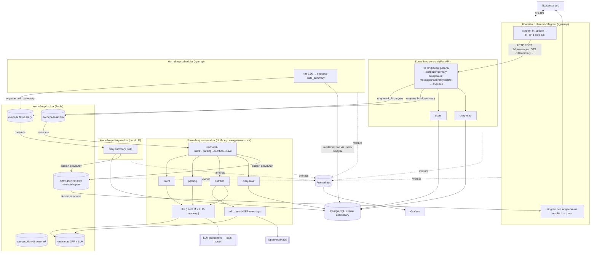
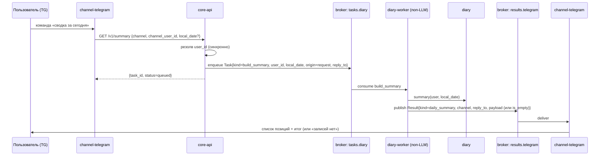
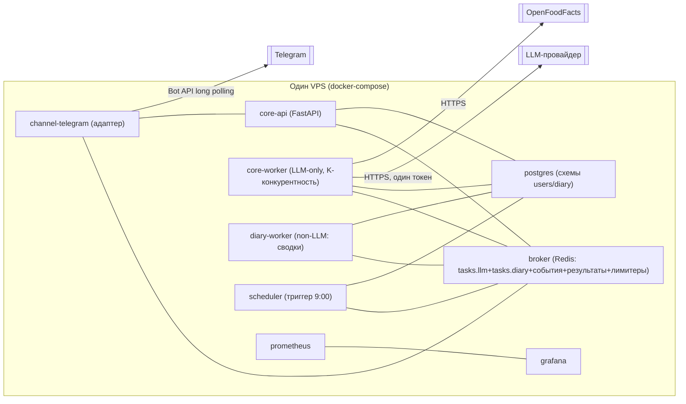

# Архитектура — Calorithm (ЧИСТОВИК)

> Статус: **чистовик, шаг 2 процесса** (`docs/development-workflow.md`), финальный такт.
> Этот документ **заменяет** черновик `docs/architecture-draft.md` (черновик v2) по статусу. Черновик сохранён для истории решений; источник истины по архитектуре — данный файл.
> Все ключевые решения согласованы автором и зафиксированы. Где остаётся свобода реализации — помечено явно («свобода реализации»). Открытых архитектурных вопросов нет.
> Связанные документы: контракты — `docs/contracts.md`; решения — `docs/adr/`; конвенции и Definition of Done — `docs/conventions.md`; требования — `docs/prd.md`.
> Дата: 2026-06-02 · Язык: русский.

---

## 1. Обзор

Calorithm — умный счётчик калорий с минимальным трением: пользователь пишет о съеденном свободным текстом, система классифицирует намерение, парсит позиции, определяет КБЖУ (OpenFoodFacts → fallback на LLM), сохраняет с изоляцией по пользователю и отдаёт дневные сводки по запросу и автоматически утром.

Продуктовый принцип (`prd.md`): **ядро + подключаемые каналы коммуникации**. Вся логика — в ядре; каналы — тонкие адаптеры. Первый и единственный в MVP канал — Telegram.

Архитектурная форма:

- **Модульный монолит ядра** со строгой развязкой модулей по коду и по схемам БД («одна схема — один владелец-модуль»), межмодульное общение — событиями через брокер. Цель — механический вынос модулей в микросервисы позже (ADR-0001).
- **Адаптеры каналов — отдельные контейнеры** с сетевой границей до ядра (ADR-0002).
- **Очередь обработки + отложенный ответ**: входящее сообщение → очередь → воркер → результат доставляется обратно в канал-источник с задержкой (ADR-0003). Промежуточная индикация «обрабатываю…» — **опциональная** деталь адаптера (нативный chat action канала или без индикации), не требование ядра.
- **Минимизация синхронных путей**: пользовательский запрос по возможности ставится в очередь, а не обрабатывается «в запросе». Сводка по запросу (US-007) — **асинхронная** (enqueue → `diary-worker` → доставка через `results.*`). Синхронны только резолв/настройки/primary и сам enqueue (ADR-0012).
- **Брокер — Redis Streams за абстракцией `MessageBus`**; Kafka — отложенное решение с зафиксированными триггерами миграции (ADR-0004).
- **`core-worker` — LLM-only**: 1 процесс, asyncio-конкурентность K=2–4; потолок темпа задаёт централизованный LLM-лимитер в Redis (ADR-0005).
- **`scheduler` — отдельный деплой-юнит** (триггер периодических работ, без LLM) и **`diary-worker` — отдельный non-LLM обработчик** (генерация/доставка сводок) (ADR-0013).
- **LiteLLM — библиотека** в модуле `llm`, без отдельного gateway (ADR-0006).
- **Масштабируемые лимитеры** (OFF и LLM) с общим состоянием в Redis (ADR-0005, ADR-0007).
- **Изменения схемы БД — только через миграции (Alembic)**; ручные `ALTER` в проде запрещены (ADR-0014).
- **Мониторинг Grafana + Prometheus с самого начала** (ADR-0010).
- **Деплой** — docker-compose на одном VPS, Telegram long polling (ADR-0011).

---

## 2. Таблица решений (сводка ADR)

| ADR | Решение | Кратко |
|---|---|---|
| [0001](adr/0001-modular-monolith-strict-decoupling.md) | Модульный монолит со строгой развязкой | Развязка по коду и по схемам БД; одна схема — один владелец; общение событиями; цель — механический вынос в сервисы. |
| [0002](adr/0002-separate-channel-adapters.md) | Отдельные контейнеры адаптеров каналов | Сетевая граница ядро/адаптер; адаптер тонкий, знает только свой транспорт. |
| [0003](adr/0003-processing-queue-deferred-reply.md) | Очередь обработки + отложенный ответ | Приём → очередь → воркер; результат с задержкой; индикация «обрабатываю…» — опциональна (деталь адаптера). |
| [0004](adr/0004-redis-streams-messagebus.md) | Redis Streams + порт `MessageBus` | At-least-once, идемпотентный handler, явный ack; Kafka отложена с триггерами миграции. |
| [0005](adr/0005-worker-concurrency-llm-limiter.md) | Параллельность воркера + централизованный LLM-лимитер | 1 воркер, K=2–4; потолок темпа — token-bucket по RPM/TPM единого токена в Redis. |
| [0006](adr/0006-litellm-as-library.md) | LiteLLM как библиотека | Без отдельного gateway-процесса; всё в модуле `llm`. |
| [0007](adr/0007-scalable-off-limiter.md) | Масштабируемый лимитер OFF | Общее состояние в Redis; graceful degradation на LLM при исчерпании бюджета. |
| [0008](adr/0008-result-delivery-via-topic.md) | Доставка результата через топик | Топик результатов по каналу; адаптер только подписан на `results.*`; вход — через `core-api`, не прямым publish. |
| [0009](adr/0009-primary-channel-auto-summary.md) | Primary-канал для авто-сводки | Мульти-канал активен; авто-сводка 9:00 — только в primary; триггерит `scheduler`, строит `diary-worker`. |
| [0010](adr/0010-monitoring-grafana-prometheus.md) | Мониторинг Grafana + Prometheus | Закладывается с самого начала; метрики LLM/очереди/лимитеров/качества/доставки. |
| [0011](adr/0011-deploy-compose-single-vps.md) | Деплой docker-compose / один VPS | 9 деплой-юнитов; Telegram long polling; один деплой-таргет. |
| [0012](adr/0012-minimize-sync-async-summary.md) | Минимизация синхронного + async-сводка | Запрос ставится в очередь; сводка US-007 асинхронна; канонический вход через `core-api`. |
| [0013](adr/0013-scheduler-and-nonllm-worker.md) | Scheduler отдельно + non-LLM воркер | `core-worker` LLM-only; `scheduler` — отдельный юнит-триггер; `diary-worker` строит сводки. |
| [0014](adr/0014-schema-changes-via-migrations-alembic.md) | Миграции схемы только через Alembic | Ручные `ALTER` в проде запрещены; ревизии обратимы; в стеке Alembic. |

---

## 3. Компоненты и ответственность

Развёртывание — **несколько контейнеров** (ADR-0002). Ядро — модульный монолит со строгой развязкой (ADR-0001): каждый модуль владеет своей схемой БД, межмодульное общение — событиями через брокер.

### 3.1. Контейнеры-сервисы

| Контейнер | Роль | Знает про Telegram? |
|---|---|---|
| **channel-telegram** (адаптер) | aiogram: приём update, опциональная индикация (нативный chat action или без неё — ADR-0003), вызов `core-api` по HTTP (вход — только через `POST /v1/messages`, прямого publish в брокер нет — ADR-0012), подписка **только** на топик результатов своего канала (`results.*`), форматирование и отправка ответа. Тонкий, знает только свой транспорт. | Да (единственный) |
| **core-api** | Канало-независимый HTTP-фасад ядра (FastAPI): приём `(channel, channel_user_id, payload)`. Синхронны только: резолв/регистрация пользователя (US-001), чтение/смена настроек (US-005), смена primary-канала. Остальные запросы — enqueue: лог еды (US-002), сводка по запросу (US-007 — теперь async), удаление (US-009) ставятся в очередь, результат — через `results.*` (ADR-0012). | Нет |
| **core-worker** | **LLM-only** потребитель очереди LLM-задач (`tasks.llm`): пайплайн intent → parsing → nutrition → save, LLM-вызовы через лимитер, публикация результата в топик доставки. Конкурентность K (ADR-0005). Периодических работ и non-LLM сводок не содержит (ADR-0013). | Нет |
| **scheduler** | Отдельный лёгкий процесс-триггер периодических работ: тикает по времени, находит пользователей с локальным 09:00 без отправленной авто-сводки и ставит задачу `build_summary` в `tasks.diary`. Сам сводку не строит и LLM не вызывает (ADR-0009, ADR-0013). | Нет |
| **diary-worker** | non-LLM потребитель `tasks.diary`: строит сводку через `diary.summary` (для US-007 по запросу и US-008 авто) и публикует `Result{kind="daily_summary"}` в `results.*`. Опционально — async-удаление (US-009). Без LLM-вызовов (ADR-0013). | Нет |
| **broker** (Redis) | Очереди задач (`tasks.llm`, `tasks.diary`) + шина межмодульных событий + топик результатов + хранилище лимитеров (OFF и LLM). | Нет |
| **postgres** | Персистентность. Логически разделён по схемам-владельцам (ADR-0001). | Нет |
| **prometheus** | Сбор метрик со всех сервисов (pull со `/metrics`). | Нет |
| **grafana** | Дашборды/алерты поверх Prometheus. | Нет |

### 3.2. Внутренние модули ядра

Живут в `core-api` / `core-worker`, каждый — владелец своей схемы, общаются событиями через брокер.

| Модуль | Ответственность | Схема-владелец |
|---|---|---|
| **users** | Резолв/создание канало-независимого пользователя; per-user настройки (timezone, confirm, dev-флаг); реестр каналов пользователя с `is_active`/`is_primary`. US-001, US-005, A1, A10. | `users` |
| **intent** | Классификация «про еду / не про еду» (US-017) через `llm`. | — (stateless) |
| **parsing** | Текст → позиции (состав, количество, оценочный вес). US-002, US-003. | — (stateless) |
| **nutrition** | КБЖУ per-item: OFF → fallback LLM; источник на уровне продукта. US-004, A9. | — (stateless; кеш опционально — свобода реализации) |
| **off_client** | HTTP-клиент OFF + масштабируемый глобальный лимитер (US-010). Единственная точка обращения к OFF. | лимитер в Redis |
| **llm** | Единственная точка LLM-вызовов через LiteLLM: ключи, модель, таймауты, ретраи, учёт стоимости/латентности, версионирование промптов, проход через централизованный LLM-лимитер (ADR-0005). | лимитер в Redis |
| **diary** | Сохранение записей с изоляцией по пользователю, хранение исходного текста сообщения, удаление по id, построение сводок, **учёт доставки авто-сводки** (`summary_dispatch`). US-002, US-006, US-007, US-008, US-009. Логика сводки и запись `summary_dispatch` исполняются в `diary-worker` (для US-007 и US-008). | `diary` (вкл. `summary_dispatch`) |
| **scheduler** | **Только триггер** периодических работ: в 9:00 по TZ пользователя (из `users`) ставит задачу `build_summary` в очередь (US-008, ADR-0009, ADR-0013). Сводку не строит, LLM не вызывает, в БД не пишет; дедуп — на стороне `diary-worker`. Деплоится отдельным юнитом. | — (stateless) |
| **bus** | Порт `MessageBus` + адаптер брокера (ADR-0004). Все межмодульные события — через него. | — |
| **config** | Конфигурация/секреты (Pydantic Settings из ENV). | — |

> Строгая развязка (ADR-0001): модуль НЕ читает чужую схему БД и НЕ импортирует чужой repository. Нужны данные другого модуля — запрос/событие через `bus`. Это делает вынос любого модуля в отдельный сервис механическим.

---

## 4. Диаграммы

### 4.1. Компоненты



### 4.2. Поток обработки сообщения про еду (через очередь, с доставкой результата)

US-002 / US-017 / US-004 / US-005. Приём и ответ развязаны очередью; результат приходит асинхронно через топик результатов; at-least-once + идемпотентность по `task_id`.

```mermaid
sequenceDiagram
  participant U as Пользователь (TG)
  participant ADP as channel-telegram
  participant API as core-api
  participant Q as broker: очередь tasks.llm
  participant W as core-worker (LLM-only)
  participant LIML as LLM-лимитер (Redis)
  participant OFF as off_client(+OFF-лимитер)
  participant LLM as llm
  participant DIA as diary
  participant RES as broker: results.telegram
  participant OUT as channel-telegram (подписчик)

  U->>ADP: «грамм 200 жареной курицы с гречкой»
  opt опциональная индикация (ADR-0003)
    ADP->>U: chat action «typing» (или без индикации)
  end
  ADP->>API: POST /v1/messages {channel, channel_user_id, text, reply_to}
  API->>API: резолв user_id (синхронно)
  API->>Q: publish Task{task_id, channel, channel_user_id, user_id, text, reply_to}
  API-->>ADP: {task_id, status=queued}
  Note over ADP: адаптер свободен, не блокируется

  Q->>W: consume (consumer group, at-least-once)
  W->>LLM: classify intent
  LLM->>LIML: acquire (RPM/TPM)
  LIML-->>LLM: ok
  alt не про еду (US-017)
    LLM-->>W: not_food
    W->>RES: publish Result{task_id, channel, reply_to, kind=not_food}
  else про еду
    W->>LLM: parse → позиции (через лимитер)
    loop по каждому продукту
      W->>OFF: lookup (если бюджет OFF есть)
      alt найдено
        OFF-->>W: КБЖУ/100г, source=OFF
      else нет / лимит исчерпан
        W->>LLM: оценка КБЖУ (через лимитер)
        LLM-->>W: КБЖУ/100г, source=LLM
      end
    end
    alt подтверждение включено (US-005)
      W->>RES: publish Result{kind=preview, items}
      Note over OUT,U: предпросмотр + кнопки; confirm идёт новой задачей через core-api → очередь
    else подтверждение выключено
      W->>DIA: save_entry(user, items) в текущий день TZ
      W->>RES: publish Result{kind=logged, breakdown+итог}
    end
  end

  RES->>OUT: deliver по channel+reply_to
  OUT->>U: финальный ответ (разбивка/итог либо «не еда»)
```

### 4.3. Поток авто-сводки в 9:00 (фоновый, без ожидающего пользователя)

US-008 / A6 / ADR-0009 / ADR-0013. `scheduler` (отдельный юнит, stateless) только триггерит: по `users.timezone` находит пользователей с локальным 09:00 и ставит задачу `build_summary` в очередь (без чтения статуса доставки). Строит, дедуплицирует и доставляет сводку non-LLM обработчик `diary-worker` (тот же код, что и для US-007). Сводка считается за прошедший день в TZ пользователя; если записей не было — не отправляется; доставка только в primary-канал. Повторный/перекрывающийся тик безопасен: дубль режет `summary_dispatch (UNIQUE)` на стороне `diary-worker`.

```mermaid
sequenceDiagram
  participant SCH as scheduler (отдельный юнит, stateless)
  participant USR as users
  participant QD as broker: tasks.diary
  participant DW as diary-worker (non-LLM)
  participant DIA as diary
  participant DSP as diary.summary_dispatch (БД)
  participant RES as broker: results.telegram
  participant OUT as channel-telegram

  Note over SCH: тикает периодически (свобода реализации: cron/loop)
  SCH->>USR: пользователи, у кого локальное время = 09:00 (только по timezone, без чтения dispatch)
  loop по каждому такому пользователю
    SCH->>QD: enqueue Task{kind=build_summary, user_id, local_date=вчера, origin=auto}
  end

  QD->>DW: consume build_summary (at-least-once; дедуп по summary_dispatch UNIQUE + task_id)
  DW->>DIA: summary(user, local_date=вчера)
  alt записей за вчера нет (A6)
    Note over DW: не отправляем, фиксируем «пусто» в dispatch
    DW->>DSP: upsert(user, local_date) [skipped]
  else есть записи
    DW->>USR: primary-канал пользователя (is_primary)
    DW->>DSP: claim(user, local_date)  %% UNIQUE защищает от дубля
    DW->>RES: publish Result{kind=daily_summary, channel=primary, reply_to=chat_id, payload}
    RES->>OUT: deliver
    OUT->>OUT: отправка в primary-канал
    DW->>DSP: mark sent_at
  end
```

> Примечание: для авто-сводки `summary_dispatch (UNIQUE user_id, local_date)` остаётся первичной защитой от дубля (рестарт/повтор `build_summary` не шлёт второй раз). Для сводки по запросу US-007 идемпотентность — по `task_id` (повтор доставки не шлёт дважды), `summary_dispatch` не используется.

### 4.4. Поток сводки по запросу (US-007, теперь асинхронный — ADR-0012)



---

## 5. Async-границы (явно)

Принцип (ADR-0012): **минимум синхронного**. Пользовательский запрос по возможности ставится в очередь, а не обрабатывается «в запросе»; единый путь доставки результата — топик `results.<channel>`.

- **Граница адаптер ↔ ядро** — сетевая (ADR-0002), **асимметрична** (ADR-0008/0012):
  - вход — **всегда HTTP** к `core-api` (`POST /v1/messages`, `GET /v1/summary`, `DELETE /v1/entries/{id}`, `POST /v1/users/resolve`, `PATCH /v1/users/settings`, `POST /v1/users/primary-channel`); прямого publish `Task` в брокер адаптер **не делает**;
  - выход — **только подписка** на брокер (топик `results.telegram`); адаптер не знает топиков задач.
- **Что синхронно (минимальный обязательный набор):** резолв/регистрация пользователя (US-001), чтение/смена настроек (US-005), смена primary-канала, и сам **enqueue** (быстрый non-blocking возврат `task_id`/`status=queued`). Обоснование: резолв — предусловие enqueue; настройки/primary — мгновенные операции над одной строкой без отложенного результата; enqueue — лишь постановка в очередь, не обработка.
- **Что асинхронно (через очередь + `results.*`):** лог еды (US-002, очередь `tasks.llm`), сводка по запросу (US-007, очередь `tasks.diary` — теперь async, ADR-0012), удаление (US-009, опционально async), авто-сводка (US-008, триггер `scheduler` → `tasks.diary`).
- **Топология обработки задач (ADR-0013):**
  - `tasks.llm` ← `ingest_message`, `confirm` → потребитель **`core-worker`** (LLM-only) → доставка `results.*`;
  - `tasks.diary` ← `build_summary` (по запросу и авто), опц. `delete_entry` → потребитель **`diary-worker`** (non-LLM) → доставка `results.*`;
  - тик 09:00 (US-008) → **`scheduler`** только ставит `build_summary` в `tasks.diary` (сам не строит).
- **Граница приём ↔ обработка** — асинхронная через очередь (ADR-0003): задачи никогда не блокируют адаптер.
- **Граница ядро ↔ ядро (модули)** — события через брокер (ADR-0001), не общие таблицы.

> Свобода реализации: confirm-flow (US-005) может реализовать подтверждение как новую задачу в очередь (callback → `core-api` → `tasks.llm`) либо как короткоживущее состояние превью. Контракт результата `kind=preview` фиксирован; внутренняя механика — на этапе реализации.

---

## 6. Модель данных MVP

Строгая развязка: каждая схема принадлежит одному модулю, кросс-схемных FK и кросс-чтений нет (ADR-0001). Типы — ориентир; точные DDL — на этапе реализации (свобода реализации в рамках инвариантов ниже).

### Схема `users` (владелец — модуль `users`)

- **`users`**
  - `id` (uuid, PK)
  - `created_at` (timestamptz)
  - `timezone` (text, по умолчанию `Europe/Moscow`) — A1
  - `confirm_enabled` (bool, по умолчанию `false`) — US-005, A7
  - `is_dev` (bool, по умолчанию `false`) — US-009, A10
  - инвариант: настройки per-user; смена TZ вне MVP (US-013), но поле есть.
- **`channel_identities`**
  - `id` (uuid, PK)
  - `user_id` (uuid → `users.id`, в пределах схемы)
  - `channel` (text, напр. `telegram`)
  - `channel_user_id` (text) — внешний id в канале
  - `is_active` (bool) — активная мульти-канальность (несколько активных каналов на пользователя)
  - `is_primary` (bool) — целевой канал авто-сводки (ADR-0009)
  - `created_at`, `last_seen_at` (timestamptz)
  - инварианты: `UNIQUE(channel, channel_user_id)`; **ровно один `is_primary=true` среди активных каналов пользователя** (обеспечивается логикой `users` при смене primary).

### Схема `diary` (владелец — модуль `diary`)

**Подтверждённая семантика:** `entry` = **один залогированный приём пищи из одного сообщения**; `entry_items` = распарсенные **позиции-продукты** внутри этого приёма (имя, граммы, КБЖУ, источник). Исходный текст сообщения хранится **на уровне `entry`** (`entries.raw_text`), а не отдельной сущностью сообщений: одно сообщение → одна запись, отдельная таблица сообщений избыточна для MVP (1:1 с `entry`) и нарушала бы простоту; при будущей потребности (например, несколько записей из одного сообщения) выделение сущности `messages` обратимо.

- **`entries`**
  - `id` (uuid/serial, PK; видимый id для dev-удаления US-009)
  - `user_id` (uuid) — изоляция по пользователю (US-006)
  - `created_at_utc` (timestamptz)
  - `local_date` (date) — «день» в TZ пользователя (US-002, US-007)
  - `raw_text` (text) — **исходный текст пользовательского сообщения**, из которого создана запись (трассируемость, отладка качества парсинга R4, повторный разбор). Связан с записью 1:1.
  - `source_task_id` (text, UNIQUE) — идемпотентность at-least-once (дубль не создаёт запись)
- **`entry_items`**
  - `id` (uuid, PK)
  - `entry_id` (→ `entries.id`, в пределах схемы)
  - `name` (text)
  - `qty_grams` (numeric)
  - `qty_is_estimated` (bool) — оценочный вес (US-003)
  - `kcal`, `protein`, `fat`, `carb` (numeric) — КБЖУ
  - `source` (enum `OFF | LLM`) — **источник per-item** (US-004, A9): разные продукты одной записи могут иметь разные источники, у каждого продукта источник один.
- **`summary_dispatch`** (в схеме `diary`)
  - `user_id` (uuid)
  - `local_date` (date)
  - `sent_at` (timestamptz, nullable — null = обработано, но пусто/не отправлено)
  - `UNIQUE(user_id, local_date)` — рестарт/повторный enqueue не шлёт дубль (US-008, A6). Владелец и единственный писатель — модуль `diary` (исполняется в `diary-worker`), т.к. именно он строит/доставляет сводку. `scheduler` к этой таблице не обращается (строгая развязка ADR-0001).

### Модуль `scheduler` — без своей схемы БД

`scheduler` — **stateless триггер по времени**: решение «слать ли сводку» принимается им только из текущего времени и `users.timezone` (через сервис `users`). Дедупликацию авто-сводки обеспечивает `diary-worker` через `summary_dispatch` (UNIQUE) — поэтому повторный/перекрывающийся тик `scheduler` безопасен. Своей схемы БД у `scheduler` нет (ранее ошибочно числилась схема `scheduler` с `summary_dispatch` — таблица перенесена во владение `diary`).

### Лимитеры (в Redis, не в Postgres)

- OFF-лимитер: общее окно/счётчик (ADR-0007).
- LLM-лимитер: token-bucket по RPM и TPM единого токена (ADR-0005).

---

## 7. Масштабируемые лимитеры

### 7.1. OFF-лимитер (US-010, G6 — ADR-0007)

- Общее состояние в Redis (не in-process): окно/счётчик на всю систему, переживает несколько воркеров/реплик.
- Реализация — token-bucket / sliding-window атомарно через Lua или `INCR`+TTL (свобода реализации в рамках атомарности).
- Единственная точка — модуль `off_client`; никто не ходит в OFF в обход.
- При исчерпании бюджета — graceful degradation на LLM-оценку (US-010, R3): запрос не валится.

### 7.2. LLM-лимитер (ADR-0005)

- Token-bucket по двум осям — **RPM** (запросов/мин) и **TPM** (токенов/мин) единственного токена — в Redis, общий на ВСЕ воркеры и процессы.
- Каждый LLM-вызов из любого воркера сначала делает `acquire()`; при исчерпании бюджета — ожидание (естественный backpressure: задачи висят на `acquire()`, новые остаются в очереди; система деградирует по латентности, а не пробивает лимит провайдера и не падает).
- Единственное место истины о темпе LLM — модуль `llm`; никакой код не вызывает LiteLLM в обход лимитера.
- Настройка под реальные лимиты токена: брать RPM/TPM из тарифа провайдера с запасом (~80% от лимита, чтобы не задевать 429) — конкретные числа задаются конфигом (свобода реализации).
- Масштаб — репликами воркера: лимитер общий, поэтому больше воркеров улучшают параллелизм не-LLM работы и устойчивость, но НЕ увеличивают LLM-throughput сверх бюджета токена (правильное поведение).

---

## 8. Мониторинг (ADR-0010)

- **Как собираем:** каждый сервис (`core-api`, `core-worker`, `diary-worker`, `scheduler`, `channel-telegram`) экспонирует `/metrics` (prometheus_client); Prometheus делает pull; Redis — через redis_exporter; Postgres — через postgres_exporter. Grafana — дашборды + алерты поверх Prometheus.
- **Минимальный набор метрик:**

| Группа | Метрики |
|---|---|
| LLM | стоимость (оценка $/токены, counter), латентность вызова (histogram), ошибки/429 (counter по типу), вызовы по назначению (intent/parse/nutrition) |
| Очередь | глубина очереди (gauge: длина stream + PEL), возраст старейшей задачи (gauge), throughput обработки, повторные доставки/ошибки воркера |
| Лимитеры | остаток бюджета OFF-лимитера (gauge), остаток бюджета LLM-лимитера RPM/TPM (gauge), число ожиданий на `acquire()` |
| Качество | успешность парсинга (доля задач без ошибки), успешность классификации intent, доля КБЖУ из OFF vs LLM-fallback |
| Доставка | результаты доставлены/ошибки доставки в канал (counter), латентность приём→ответ (histogram) |

- **Алерты-кандидаты:** рост глубины очереди, всплеск 429 LLM, исчерпание бюджета лимитера, падение успешности парсинга/классификации.

---

## 9. Деплой-форма (ADR-0011)



**Деплой-юниты (явный перечень, 9):**
1. `channel-telegram` — адаптер канала.
2. `core-api` — HTTP-фасад ядра (FastAPI).
3. `core-worker` — **LLM-only** воркер очереди `tasks.llm` (1 реплика, K=2–4).
4. `diary-worker` — **non-LLM** воркер очереди `tasks.diary` (генерация/доставка сводок US-007/US-008).
5. `scheduler` — отдельный лёгкий триггер периодических работ (enqueue `build_summary` в 9:00).
6. `broker` — Redis (очереди задач `tasks.llm`/`tasks.diary`, шина событий, топик результатов, лимитеры OFF и LLM).
7. `postgres` — БД (логические схемы-владельцы).
8. `prometheus` — сбор метрик.
9. `grafana` — дашборды/алерты.

- Оркестрация — **docker-compose** на одном VPS. Граница ядро/адаптер реальная (сеть), но всё на одном хосте — деплой простой.
- Миграции схемы (Alembic, ADR-0014) применяются при запуске compose (one-shot шаг до старта сервисов); ручные `ALTER` в проде запрещены.
- Telegram: **long polling** в MVP (без публичного HTTPS/вебхука). `core-api` слушает HTTP только внутри compose-сети (плюс `/metrics`).
- Соответствует «деплой стоит с самого начала» (workflow п.3); распределённость реальная (брокер, отдельные процессы), но один деплой-таргет.

> Рекомендация (ADR-0013): `scheduler` и `diary-worker` — **отдельные деплой-юниты**, чтобы жизненный цикл периодических/non-LLM работ не зависел от LLM-воркера. Оба non-LLM и при желании могут быть слиты в один lightweight-процесс позже без изменения контрактов — обратимо.

---

## 10. Стек, инструменты, конфигурация и секреты

**Стек/инструменты:** Python · FastAPI · aiogram · PostgreSQL · Redis (Streams) · LiteLLM · Docker / docker-compose · **Alembic** (миграции схемы БД — ADR-0014) · Prometheus + Grafana (мониторинг). Конкретные версии — в lock-файле на старте реализации.

**Миграции БД:** любые изменения схемы — только через миграции Alembic; ручные `ALTER`/`DROP` в проде запрещены; ревизии обратимы (ADR-0014; правила — `conventions.md`, DoD).

### Конфигурация и секреты

- **Pydantic Settings** из ENV. Секреты: `TELEGRAM_BOT_TOKEN`, `LLM_*` (единый токен/провайдер/модель + RPM/TPM для лимитера), `DATABASE_URL`, `REDIS_URL`, `OFF_*` (User-Agent/контакт/лимиты).
- Локально — `.env` (в `.gitignore`); прод — ENV контейнеров / secrets VPS; в репозитории — только `.env.example`.
- Модуль `config` — единственный источник истины; модули получают настройки инъекцией, не читают ENV напрямую.
- Подробности — `docs/conventions.md`, раздел «Конфигурация и секреты».

---

## 11. Соответствие PRD

| US / требование | Где в архитектуре |
|---|---|
| US-001 регистрация / `/start` | `core-api` (регистрация), модуль `users`, схема `users` |
| US-002 лог еды свободным текстом | поток §4.2, модули `parsing`/`nutrition`, очередь |
| US-003 граммы/порции, оценочный вес | `parsing`, `entry_items.qty_is_estimated` |
| US-004 КБЖУ + fallback, источник per-item | `nutrition`, `off_client`, `llm`, `entry_items.source` |
| US-005 per-user подтверждение | `users.confirm_enabled`, `kind=preview` |
| US-006 изоляция по пользователю | `diary`, `entries.user_id` |
| US-007 сводка по запросу | `core-api` enqueue → `diary-worker` → `results.*` (асинхронно, §4.4, ADR-0012) |
| US-008 авто-сводка 9:00 (primary) | `scheduler` (триггер) → `diary-worker` (строит) → primary, поток §4.3, ADR-0009/0013 |
| US-009 удаление командой (dev) | `core-api` → `diary`, `users.is_dev`, видимый `entries.id` |
| US-010 глобальный лимит OFF | `off_client` + OFF-лимитер в Redis (§7.1) |
| US-017 классификация намерения | `intent` через `llm` |
| A6 пустой день — не слать | `summary_dispatch`, поток §4.3 |
| A9 источник per-item | `entry_items.source` |
| Мульти-канальность (A4 на будущее, активна в MVP по решению автора) | `channel_identities.is_active/is_primary` |
```
