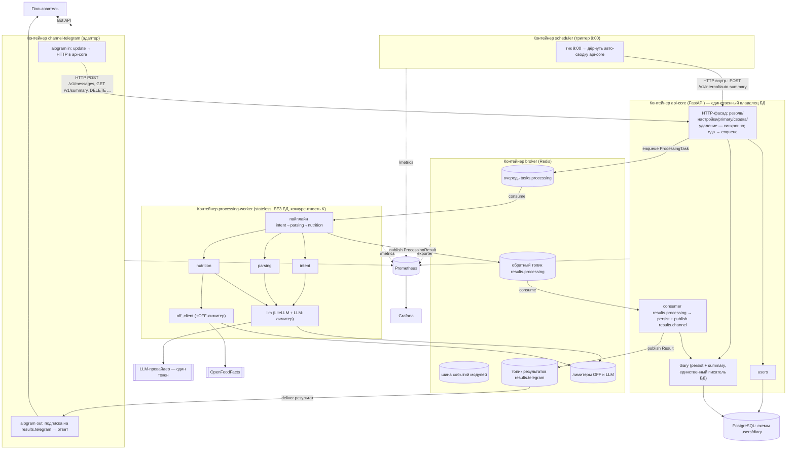
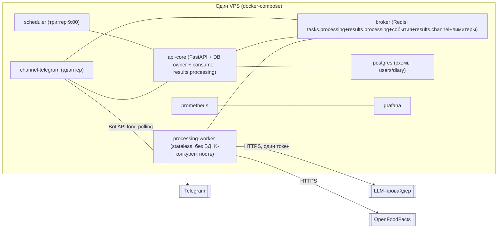

# Архитектура — Calorithm (ЧИСТОВИК)

> Статус: **чистовик, шаг 2 процесса** (`docs/development-workflow.md`), финальный такт.
> Этот документ **заменяет** черновик `docs/architecture-draft.md` (черновик v2) по статусу. Черновик сохранён для истории решений; источник истины по архитектуре — данный файл.
> Все ключевые решения согласованы автором и зафиксированы. Где остаётся свобода реализации — помечено явно («свобода реализации»). Открытых архитектурных вопросов нет.
> Связанные документы: контракты — `docs/contracts.md`; решения — `docs/adr/`; конвенции и Definition of Done — `docs/conventions.md`; требования — `docs/prd.md`.
> Дата: 2026-06-02 · Язык: русский.

---

## 1. Обзор

Calorithm — умный счётчик калорий с минимальным трением: пользователь пишет о съеденном свободным текстом, система классифицирует намерение, парсит позиции, определяет КБЖУ (OpenFoodFacts → fallback на LLM), сохраняет с изоляцией по пользователю и отдаёт дневные сводки по запросу и автоматически утром.

Продуктовый принцип (`prd.md`): **ядро + подключаемые каналы коммуникации**. Вся логика — в ядре; каналы — тонкие адаптеры. Первый и единственный в MVP канал — Telegram.

Архитектурная форма:

- **Модульный монолит ядра** со строгой развязкой модулей по коду и по схемам БД («одна схема — один владелец-модуль»), межмодульное общение — событиями через брокер. Цель — механический вынос модулей в микросервисы позже (ADR-0001).
- **Адаптеры каналов — отдельные контейнеры** с сетевой границей до ядра (ADR-0002).
- **Единый `api-core` (FastAPI) делает всю синхронную работу и является единственным владельцем БД** (ADR-0015): резолв/настройки/primary, сводки (по запросу и авто — синхронно), мягкое удаление, **persist записей**. Внутри — модульная структура с владением схемами per-module (`users`, `diary`) для будущего выноса (ADR-0001).
- **Асинхронность только там, где есть внешний/медленный/лимитируемый вызов** (LLM, OFF). Один stateless `processing-worker` — чистый вычислитель пайплайна обработки сообщения (intent → parsing → nutrition), **без доступа к БД** (ADR-0015). Очередь обработки + отложенный ответ (ADR-0003): входящее сообщение → `tasks.processing` → воркер → результат возвращается в `api-core`, тот персистит и доставляет в канал. Промежуточная индикация «обрабатываю…» — **опциональная** деталь адаптера.
- **`api-core` оркеструет, воркер только считает; обратный хоп через брокер** (ADR-0015): воркер публикует результат в `results.processing`, `api-core` потребляет, персистит запись (единственный писатель БД) и публикует `Result` в `results.<channel>` для адаптера (ADR-0008).
- **Брокер — Redis Streams за абстракцией `MessageBus`**; Kafka — отложенное решение с зафиксированными триггерами миграции (ADR-0004).
- **`processing-worker`** — 1 процесс, asyncio-конкурентность K=2–4; потолок темпа задаёт централизованный LLM-лимитер в Redis (ADR-0005). LLM/OFF — единственные точки с лимитерами.
- **`scheduler` — отдельный деплой-юнит** (stateless-триггер 09:00, без LLM/БД); триггерит **синхронную** генерацию/доставку авто-сводки в `api-core` (ADR-0018). `diary-worker` удалён (ADR-0015).
- **Always-write + статусная модель `entry` + мягкое удаление** (ADR-0016): запись сохраняется всегда; в сводках учитываются только `status='confirmed'`; удаление — мягкое.
- **Отключаемая авто-сводка**: per-user флаг `auto_summary_enabled` (default включена) (ADR-0018).
- **Сквозная трассируемость «сообщение → КБЖУ»**: корреляция по `task_id` + персист промежуточных артефактов (intent/parse/source/model_meta) (ADR-0017).
- **LiteLLM — библиотека** в модуле `llm`, без отдельного gateway (ADR-0006).
- **Масштабируемые лимитеры** (OFF и LLM) с общим состоянием в Redis (ADR-0005, ADR-0007).
- **Изменения схемы БД — только через миграции (Alembic)**; ручные `ALTER` в проде запрещены (ADR-0014).
- **Мониторинг Grafana + Prometheus с самого начала** (ADR-0010).
- **Деплой** — docker-compose на одном VPS, **8 деплой-юнитов**, Telegram long polling (ADR-0011, обновлён ADR-0015).

---

## 2. Таблица решений (сводка ADR)

| ADR | Решение | Кратко |
|---|---|---|
| [0001](adr/0001-modular-monolith-strict-decoupling.md) | Модульный монолит со строгой развязкой | Развязка по коду и по схемам БД; одна схема — один владелец; общение событиями; цель — механический вынос в сервисы. |
| [0002](adr/0002-separate-channel-adapters.md) | Отдельные контейнеры адаптеров каналов | Сетевая граница ядро/адаптер; адаптер тонкий, знает только свой транспорт. |
| [0003](adr/0003-processing-queue-deferred-reply.md) | Очередь обработки + отложенный ответ | Приём → очередь → воркер; результат с задержкой; индикация «обрабатываю…» — опциональна (деталь адаптера). |
| [0004](adr/0004-redis-streams-messagebus.md) | Redis Streams + порт `MessageBus` | At-least-once, идемпотентный handler, явный ack; Kafka отложена с триггерами миграции. |
| [0005](adr/0005-worker-concurrency-llm-limiter.md) | Параллельность воркера + централизованный LLM-лимитер | 1 воркер, K=2–4; потолок темпа — token-bucket по RPM/TPM единого токена в Redis. |
| [0006](adr/0006-litellm-as-library.md) | LiteLLM как библиотека | Без отдельного gateway-процесса; всё в модуле `llm`. |
| [0007](adr/0007-scalable-off-limiter.md) | Масштабируемый лимитер OFF | Общее состояние в Redis; graceful degradation на LLM при исчерпании бюджета. |
| [0008](adr/0008-result-delivery-via-topic.md) | Доставка результата через топик (дополнен 0015) | Топик `results.<channel>` по каналу; адаптер только подписан на `results.*`. Единственный публикатор `results.<channel>` — `api-core`; воркер возвращает результат в `api-core` через `results.processing`. |
| [0009](adr/0009-primary-channel-auto-summary.md) | Primary-канал для авто-сводки (дополнен 0018) | Мульти-канал активен; авто-сводка 9:00 — только в primary; триггерит `scheduler`, строит синхронно `api-core`. |
| [0010](adr/0010-monitoring-grafana-prometheus.md) | Мониторинг Grafana + Prometheus | Закладывается с самого начала; метрики LLM/очереди/лимитеров/качества/доставки. |
| [0011](adr/0011-deploy-compose-single-vps.md) | Деплой docker-compose / один VPS (обновлён 0015) | 8 деплой-юнитов; Telegram long polling; один деплой-таргет. |
| [0012](adr/0012-minimize-sync-async-summary.md) | Минимизация синхронного (изменён 0015) | Async только для LLM/OFF-пайплайна; сводка US-007 — **снова синхронна**; канонический вход через `api-core`. |
| [0013](adr/0013-scheduler-and-nonllm-worker.md) | ~~Scheduler отдельно + non-LLM воркер~~ (**заменён 0015**) | Исторический: вводил `diary-worker`/`tasks.diary`. Отменён: один `processing-worker`, сводка синхронна. |
| [0014](adr/0014-schema-changes-via-migrations-alembic.md) | Миграции схемы только через Alembic | Ручные `ALTER` в проде запрещены; ревизии обратимы; в стеке Alembic. |
| [0015](adr/0015-single-api-core-sole-db-owner-single-worker.md) | Единый `api-core` (владелец БД) + один воркер | `api-core` делает всю синхронную работу и единственный пишет в БД; `processing-worker` — stateless LLM/OFF-пайплайн без БД; возврат через `results.processing`. Supersedes 0013; amends 0012/0009. |
| [0016](adr/0016-entry-status-always-write-soft-delete.md) | Always-write + статус `entry` + soft-delete | Запись всегда сохраняется; статусы `pending/confirmed/rejected/deleted`; в сводках — только `confirmed`; удаление мягкое. |
| [0017](adr/0017-end-to-end-traceability.md) | Сквозная трассируемость сообщение→КБЖУ | Корреляция по `task_id`; персист артефактов (intent/parse/source/model_meta) для разбора ошибок. |
| [0018](adr/0018-auto-summary-toggle-scheduler-sync-trigger.md) | Отключаемая авто-сводка + scheduler-триггер | Per-user `auto_summary_enabled` (default on); `scheduler` дёргает синхронную сводку в `api-core`. Amends 0009. |

---

## 3. Компоненты и ответственность

Развёртывание — **несколько контейнеров** (ADR-0002). Ядро — модульный монолит со строгой развязкой (ADR-0001): каждый модуль владеет своей схемой БД, межмодульное общение — событиями через брокер.

### 3.1. Контейнеры-сервисы

> Имя сервиса ядра — **`api-core`** (FastAPI). В путях эндпоинтов и именах топиков может встречаться исторический префикс `core-api`/`core_api` — это тот же компонент (свобода реализации в именовании каталога; роль и контракт — `api-core`).

| Контейнер | Роль | Знает про Telegram? |
|---|---|---|
| **channel-telegram** (адаптер) | aiogram: приём update, опциональная индикация (нативный chat action или без неё — ADR-0003), вызов `api-core` по HTTP (вход — только через `POST /v1/messages` и др. эндпоинты, прямого publish в брокер нет — ADR-0012), подписка **только** на топик результатов своего канала (`results.<channel>`), форматирование и отправка ответа. Тонкий, знает только свой транспорт. | Да (единственный) |
| **api-core** | Канало-независимый HTTP-фасад ядра (FastAPI) **и единственный владелец БД** (ADR-0015). Делает **всю синхронную работу**: резолв/регистрация (US-001), чтение/смена настроек вкл. `auto_summary_enabled` (US-005, ADR-0018), смена primary, **сводка по запросу и авто-сводка синхронно** (US-007/US-008, чтение БД + формат), мягкое удаление (US-009, ADR-0016), **persist записей еды**. Для еды (US-002): ставит `ProcessingTask` в `tasks.processing`, затем потребляет `results.processing`, персистит запись и публикует `Result` в `results.<channel>`. Внутри — модули-владельцы схем (`users`, `diary`). | Нет |
| **processing-worker** | **Stateless async-вычислитель** пайплайна обработки сообщения (`tasks.processing`): intent → parsing → nutrition (OFF через OFF-лимитер, fallback LLM через LLM-лимитер), сбор артефактов трассировки (ADR-0017). **БД не касается** (ADR-0015). Возвращает `ProcessingResult` (позиции + КБЖУ + источники + артефакты) в `results.processing`. Конкурентность K (ADR-0005). | Нет |
| **scheduler** | Отдельный лёгкий stateless-триггер 09:00: тикает по времени, для пользователей с локальным 09:00 **дёргает внутренний механизм `api-core`** (авто-сводка). Сводку не строит, в БД/LLM не ходит (ADR-0009, ADR-0018). | Нет |
| **broker** (Redis) | Очередь задач `tasks.processing` + обратный топик `results.processing` (воркер → `api-core`) + шина межмодульных событий + топики `results.<channel>` (доставка в адаптеры) + хранилище лимитеров (OFF и LLM). | Нет |
| **postgres** | Персистентность. Логически разделён по схемам-владельцам (ADR-0001). | Нет |
| **prometheus** | Сбор метрик со всех сервисов (pull со `/metrics`). | Нет |
| **grafana** | Дашборды/алерты поверх Prometheus. | Нет |

### 3.2. Внутренние модули ядра

Все модули с БД (`users`, `diary`) живут в `api-core` (единственный владелец БД, ADR-0015); stateless-модули пайплайна (`intent`, `parsing`, `nutrition`, `off_client`, `llm`) живут в `processing-worker`. Каждый модуль с БД — владелец своей схемы, общаются событиями через брокер.

| Модуль | Ответственность | Схема-владелец |
|---|---|---|
| **users** | Резолв/создание канало-независимого пользователя; per-user настройки (timezone, confirm, dev-флаг, `auto_summary_enabled` — ADR-0018); реестр каналов пользователя с `is_active`/`is_primary`. US-001, US-005, A1, A10. | `users` |
| **intent** | Классификация «про еду / не про еду» (US-017) через `llm`. Живёт в `processing-worker`. | — (stateless) |
| **parsing** | Текст → позиции (состав, количество, оценочный вес). US-002, US-003. Живёт в `processing-worker`. | — (stateless) |
| **nutrition** | КБЖУ per-item: OFF → fallback LLM; источник на уровне продукта. US-004, A9. Живёт в `processing-worker`. | — (stateless; кеш опционально — свобода реализации) |
| **off_client** | HTTP-клиент OFF + масштабируемый глобальный лимитер (US-010). Единственная точка обращения к OFF. Живёт в `processing-worker`. | лимитер в Redis |
| **llm** | Единственная точка LLM-вызовов через LiteLLM: ключи, модель, таймауты, ретраи, учёт стоимости/латентности, версионирование промптов (`model_meta` для трассы — ADR-0017), проход через централизованный LLM-лимитер (ADR-0005). Живёт в `processing-worker`. | лимитер в Redis |
| **diary** | **В `api-core`.** Сохранение записей с изоляцией по пользователю (always-write + статус `entry`, ADR-0016), хранение `raw_text` и артефактов трассировки (ADR-0017), мягкое удаление по id (US-009), **синхронное построение сводок** (US-007/US-008, фильтр `status='confirmed'`), **учёт доставки авто-сводки** (`summary_dispatch`). US-002, US-006, US-007, US-008, US-009. Единственный писатель `entries`/`entry_items`/`summary_dispatch`. | `diary` (вкл. `summary_dispatch`) |
| **scheduler** | **Только триггер**: в 9:00 по TZ пользователя дёргает внутренний механизм `api-core` для авто-сводки (US-008, ADR-0009, ADR-0018). Сводку не строит, LLM не вызывает, в БД не пишет; дедуп — на стороне `api-core` (`summary_dispatch`). Деплоится отдельным юнитом. | — (stateless) |
| **bus** | Порт `MessageBus` + адаптер брокера (ADR-0004). Все межмодульные события — через него. | — |
| **config** | Конфигурация/секреты (Pydantic Settings из ENV). | — |

> Строгая развязка (ADR-0001): модуль НЕ читает чужую схему БД и НЕ импортирует чужой repository. Нужны данные другого модуля — запрос/событие через `bus`. Это делает вынос любого модуля в отдельный сервис механическим.

---

## 4. Диаграммы

### 4.1. Компоненты



### 4.2. Поток обработки сообщения про еду (через очередь, с доставкой результата)

US-002 / US-017 / US-004 / US-005 (always-write — ADR-0016). Приём и обработка развязаны очередью; воркер считает без БД и возвращает результат в `api-core`, тот персистит (always-write) и доставляет в канал. at-least-once + идемпотентность по `task_id` (`entries.source_task_id`).

```mermaid
sequenceDiagram
  participant U as Пользователь (TG)
  participant ADP as channel-telegram
  participant API as api-core (HTTP + DB owner)
  participant Q as broker: tasks.processing
  participant W as processing-worker (stateless, без БД)
  participant LIML as LLM-лимитер (Redis)
  participant OFF as off_client(+OFF-лимитер)
  participant LLM as llm
  participant RP as broker: results.processing
  participant DB as PostgreSQL (схема diary)
  participant RES as broker: results.telegram
  participant OUT as channel-telegram (подписчик)

  U->>ADP: «грамм 200 жареной курицы с гречкой»
  opt опциональная индикация (ADR-0003)
    ADP->>U: chat action «typing» (или без индикации)
  end
  ADP->>API: POST /v1/messages {channel, channel_user_id, text, reply_to}
  API->>API: резолв user_id (синхронно)
  API->>Q: publish ProcessingTask{task_id, user_id, channel, channel_user_id, text, reply_to, confirm_enabled}
  API-->>ADP: {task_id, status=queued}
  Note over ADP: адаптер свободен, не блокируется

  Q->>W: consume (consumer group, at-least-once)
  W->>LLM: classify intent (acquire LLM-лимитер RPM/TPM)
  alt не про еду (US-017)
    W->>RP: publish ProcessingResult{task_id, intent=not_food}
  else про еду
    W->>LLM: parse → позиции (через лимитер)
    loop по каждому продукту
      W->>OFF: lookup (если бюджет OFF есть)
      alt найдено
        OFF-->>W: КБЖУ/100г, source=OFF
      else нет / лимит исчерпан
        W->>LLM: оценка КБЖУ (через лимитер)
        LLM-->>W: КБЖУ/100г, source=LLM
      end
    end
    W->>RP: publish ProcessingResult{task_id, items, totals, artifacts (intent/parse/source/model_meta)}
  end

  RP->>API: consume ProcessingResult (api-core — потребитель)
  alt не про еду
    Note over API: записи нет; готовим Result
  else про еду (always-write — ADR-0016)
    API->>DB: persist entry+items+артефакты; status = confirmed (confirm off) / pending (confirm on)
    alt confirm включён (US-005)
      Note over API: status=pending; Result → подтверждение придёт новой задачей
    else confirm выключен
      Note over API: status=confirmed; Result{kind=logged, breakdown+итог}
    end
  end
  API->>RES: publish Result{task_id, channel, reply_to, kind, payload}
  RES->>OUT: deliver по channel+reply_to
  OUT->>U: финальный ответ (разбивка/итог · превью · «не еда»)
```

### 4.3. Поток авто-сводки в 9:00 (фоновый, без ожидающего пользователя)

US-008 / A6 / ADR-0009 / ADR-0018. `scheduler` (отдельный юнит, stateless) только триггерит: по `users.timezone` находит пользователей с локальным 09:00 и **дёргает внутренний механизм `api-core`** (HTTP внутри compose-сети). Всю логику — проверку `auto_summary_enabled`, чтение записей (только `status='confirmed'`), формат, дедуп через `summary_dispatch`, публикацию в primary-канал — исполняет синхронно `api-core`. Сводка за прошедший день в TZ пользователя; если записей нет или флаг выключен — не отправляется. Повторный/перекрывающийся тик безопасен: дубль режет `summary_dispatch (UNIQUE)` в `api-core`.

```mermaid
sequenceDiagram
  participant SCH as scheduler (отдельный юнит, stateless)
  participant API as api-core (синхронно, DB owner)
  participant USR as users
  participant DIA as diary (+summary_dispatch)
  participant DB as PostgreSQL
  participant RES as broker: results.telegram
  participant OUT as channel-telegram

  Note over SCH: тикает периодически (свобода реализации: cron/loop)
  SCH->>API: POST /v1/internal/auto-summary (пользователи с локальным 09:00 или один тик-on-all)
  loop по каждому пользователю с локальным 09:00
    API->>USR: auto_summary_enabled? primary-канал?
    alt флаг выключен (ADR-0018)
      Note over API: пропускаем пользователя
    else флаг включён
      API->>DIA: summary(user, local_date=вчера; фильтр status=confirmed)
      DIA->>DB: read confirmed entries
      alt записей за вчера нет (A6)
        Note over API: не отправляем, фиксируем «пусто»
        API->>DB: upsert summary_dispatch(user, local_date) [skipped]
      else есть записи
        API->>DB: claim summary_dispatch(user, local_date)  %% UNIQUE защищает от дубля
        API->>RES: publish Result{kind=daily_summary, channel=primary, reply_to, payload}
        RES->>OUT: deliver в primary-канал
        API->>DB: mark sent_at
      end
    end
  end
```

> Примечание: `summary_dispatch (UNIQUE user_id, local_date)` остаётся первичной защитой от дубля авто-сводки (рестарт/повторный тик не шлёт второй раз). Пишет таблицу только `api-core` (владелец схемы `diary`); `scheduler` к ней не обращается. Для сводки по запросу (US-007) `summary_dispatch` не используется — она синхронна и идемпотентна по природе (чтение + ответ в HTTP).

### 4.4. Поток сводки по запросу (US-007, синхронный — ADR-0015)

```mermaid
sequenceDiagram
  participant U as Пользователь (TG)
  participant ADP as channel-telegram
  participant API as api-core (синхронно, DB owner)
  participant DIA as diary
  participant DB as PostgreSQL

  U->>ADP: команда «сводка за сегодня»
  ADP->>API: GET /v1/summary {channel, channel_user_id, local_date?}
  API->>API: резолв user_id (синхронно)
  API->>DIA: summary(user, local_date; фильтр status=confirmed)
  DIA->>DB: read confirmed entries
  DB-->>DIA: позиции + итоги
  API-->>ADP: SummaryResponse{local_date, items, totals, is_empty}
  ADP->>U: список позиций + итог (или «записей нет»)
```

> Сводка по запросу — чтение БД + формат, без LLM/OFF и без очереди: возвращается прямо в HTTP-ответе (ADR-0015). Доставки через `results.<channel>` для неё не нужно.

---

## 5. Async-границы (явно)

Принцип (ADR-0015, уточняет ADR-0012): **async только там, где есть внешний/медленный/лимитируемый вызов** (LLM, OFF). Всё остальное (резолв, настройки, primary, сводки, удаление, persist) — **синхронно** в `api-core`. Асинхронен ровно один путь: обработка сообщения о еде (пайплайн в `processing-worker`).

- **Граница адаптер ↔ ядро** — сетевая (ADR-0002), **асимметрична** (ADR-0008/0012):
  - вход — **всегда HTTP** к `api-core` (`POST /v1/messages`, `GET /v1/summary`, `DELETE /v1/entries/{id}`, `POST /v1/users/resolve`, `PATCH /v1/users/settings`, `POST /v1/users/primary-channel`); прямого publish `Task` в брокер адаптер **не делает**;
  - выход — **только подписка** на брокер (топик `results.<channel>`, в MVP `results.telegram`); адаптер не знает топиков задач.
- **Что синхронно (в HTTP-ответе `api-core`):** резолв/регистрация (US-001), чтение/смена настроек вкл. `auto_summary_enabled` (US-005), смена primary, **сводка по запросу (US-007)**, **мягкое удаление (US-009)**, и **enqueue еды** (быстрый non-blocking возврат `task_id`/`status=queued`). Авто-сводка (US-008) — синхронно в `api-core` по триггеру `scheduler`.
- **Что асинхронно (единственный путь — через очередь):** обработка сообщения о еде (US-002/US-017/US-004) — `ProcessingTask` в `tasks.processing` → `processing-worker` (LLM/OFF под лимитерами) → `ProcessingResult` в `results.processing` → `api-core` персистит и публикует `Result` в `results.<channel>`.
- **Топология задач (ADR-0015):**
  - `tasks.processing` ← `ProcessingTask` (ingest, и confirm как новая задача — свобода реализации) → потребитель **`processing-worker`** (stateless, без БД) → возврат в `results.processing`;
  - `results.processing` ← `ProcessingResult` → потребитель **`api-core`** → persist → `results.<channel>`;
  - тик 09:00 (US-008) → **`scheduler`** дёргает внутренний синхронный механизм `api-core` (ADR-0018); очереди для сводок нет.
- **Граница приём ↔ обработка еды** — асинхронная через очередь (ADR-0003): задачи никогда не блокируют адаптер.
- **Граница `api-core` ↔ `processing-worker`** — брокер (`tasks.processing` туда, `results.processing` обратно); воркер БД не касается, `api-core` — единственный писатель БД (ADR-0015).
- **Граница ядро ↔ ядро (модули)** — события через брокер (ADR-0001), не общие таблицы.

> Свобода реализации: confirm-flow (US-005) — подтверждение может быть новой задачей `ProcessingTask` (callback → `api-core` → `tasks.processing`) либо переходом статуса уже сохранённой `pending`-записи в `confirmed` без повторного прогона пайплайна (ADR-0016). Контракт результата `kind=preview` фиксирован; механика — на этапе реализации.

---

## 6. Модель данных MVP

Строгая развязка: каждая схема принадлежит одному модулю, кросс-схемных FK и кросс-чтений нет (ADR-0001). Типы — ориентир; точные DDL — на этапе реализации (свобода реализации в рамках инвариантов ниже).

### Схема `users` (владелец — модуль `users`)

- **`users`**
  - `id` (uuid, PK)
  - `created_at` (timestamptz)
  - `timezone` (text, по умолчанию `Europe/Moscow`) — A1
  - `confirm_enabled` (bool, по умолчанию `false`) — US-005, A7
  - `auto_summary_enabled` (bool, по умолчанию `true`) — отключаемая авто-сводка (US-008, ADR-0018)
  - `is_dev` (bool, по умолчанию `false`) — US-009, A10
  - инвариант: настройки per-user; смена TZ вне MVP (US-013), но поле есть.
- **`channel_identities`**
  - `id` (uuid, PK)
  - `user_id` (uuid → `users.id`, в пределах схемы)
  - `channel` (text, напр. `telegram`)
  - `channel_user_id` (text) — внешний id в канале
  - `is_active` (bool) — активная мульти-канальность (несколько активных каналов на пользователя)
  - `is_primary` (bool) — целевой канал авто-сводки (ADR-0009)
  - `created_at`, `last_seen_at` (timestamptz)
  - инварианты: `UNIQUE(channel, channel_user_id)`; **ровно один `is_primary=true` среди активных каналов пользователя** (обеспечивается логикой `users` при смене primary).

### Схема `diary` (владелец — модуль `diary`)

**Подтверждённая семантика:** `entry` = **один залогированный приём пищи из одного сообщения**; `entry_items` = распарсенные **позиции-продукты** внутри этого приёма (имя, граммы, КБЖУ, источник). Исходный текст сообщения хранится **на уровне `entry`** (`entries.raw_text`), а не отдельной сущностью сообщений: одно сообщение → одна запись, отдельная таблица сообщений избыточна для MVP (1:1 с `entry`) и нарушала бы простоту; при будущей потребности (например, несколько записей из одного сообщения) выделение сущности `messages` обратимо.

- **`entries`**
  - `id` (uuid/serial, PK; видимый id для dev-удаления US-009)
  - `user_id` (uuid) — изоляция по пользователю (US-006)
  - `created_at_utc` (timestamptz)
  - `local_date` (date) — «день» в TZ пользователя (US-002, US-007)
  - `status` (enum `pending | confirmed | rejected | deleted`) — статусная модель always-write (ADR-0016); **в сводках учитываются только `confirmed`**.
  - `status_reason` (text, nullable) — причина текущего статуса (`user_rejected`, `user_deleted`, …) — ADR-0016.
  - `status_changed_at` (timestamptz) — аудит перехода статуса.
  - `raw_text` (text) — **исходный текст пользовательского сообщения** (трассируемость R4, повторный разбор; ADR-0017). 1:1 с записью.
  - артефакты трассировки (ADR-0017): `intent_result`, `parse_artifact`, `model_meta` — итог классификации/парсинга и метаданные модели/версии промпта (поля `entry` либо таблица `entry_trace` 1:1 — свобода реализации в схеме `diary`).
  - `source_task_id` (text, UNIQUE) — идемпотентность at-least-once (дубль не создаёт запись)
- **`entry_items`**
  - `id` (uuid, PK)
  - `entry_id` (→ `entries.id`, в пределах схемы)
  - `name` (text)
  - `qty_grams` (numeric)
  - `qty_is_estimated` (bool) — оценочный вес (US-003)
  - `kcal`, `protein`, `fat`, `carb` (numeric) — КБЖУ
  - `source` (enum `OFF | LLM`) — **источник per-item** (US-004, A9): разные продукты одной записи могут иметь разные источники, у каждого продукта источник один.
- **`summary_dispatch`** (в схеме `diary`)
  - `user_id` (uuid)
  - `local_date` (date)
  - `sent_at` (timestamptz, nullable — null = обработано, но пусто/не отправлено)
  - `UNIQUE(user_id, local_date)` — рестарт/повторный тик не шлёт дубль авто-сводки (US-008, A6). Владелец и единственный писатель — модуль `diary` в составе `api-core` (ADR-0015), т.к. именно `api-core` строит/доставляет сводку. `scheduler` к этой таблице не обращается (строгая развязка ADR-0001).

### Модуль `scheduler` — без своей схемы БД

`scheduler` — **stateless триггер по времени**: тикает и дёргает внутренний механизм `api-core` (ADR-0018). Проверку `auto_summary_enabled`, чтение `users.timezone`, дедуп через `summary_dispatch` (UNIQUE) и доставку делает синхронно `api-core` — поэтому повторный/перекрывающийся тик `scheduler` безопасен. Своей схемы БД у `scheduler` нет; в БД и LLM не ходит.

### Лимитеры (в Redis, не в Postgres)

- OFF-лимитер: общее окно/счётчик (ADR-0007).
- LLM-лимитер: token-bucket по RPM и TPM единого токена (ADR-0005).

---

## 7. Масштабируемые лимитеры

### 7.1. OFF-лимитер (US-010, G6 — ADR-0007)

- Общее состояние в Redis (не in-process): окно/счётчик на всю систему, переживает несколько воркеров/реплик.
- Реализация — token-bucket / sliding-window атомарно через Lua или `INCR`+TTL (свобода реализации в рамках атомарности).
- Единственная точка — модуль `off_client`; никто не ходит в OFF в обход.
- При исчерпании бюджета — graceful degradation на LLM-оценку (US-010, R3): запрос не валится.

### 7.2. LLM-лимитер (ADR-0005)

- Token-bucket по двум осям — **RPM** (запросов/мин) и **TPM** (токенов/мин) единственного токена — в Redis, общий на ВСЕ воркеры и процессы.
- Каждый LLM-вызов из любого воркера сначала делает `acquire()`; при исчерпании бюджета — ожидание (естественный backpressure: задачи висят на `acquire()`, новые остаются в очереди; система деградирует по латентности, а не пробивает лимит провайдера и не падает).
- Единственное место истины о темпе LLM — модуль `llm`; никакой код не вызывает LiteLLM в обход лимитера.
- Настройка под реальные лимиты токена: брать RPM/TPM из тарифа провайдера с запасом (~80% от лимита, чтобы не задевать 429) — конкретные числа задаются конфигом (свобода реализации).
- Масштаб — репликами воркера: лимитер общий, поэтому больше воркеров улучшают параллелизм не-LLM работы и устойчивость, но НЕ увеличивают LLM-throughput сверх бюджета токена (правильное поведение).

---

## 8. Мониторинг (ADR-0010)

- **Как собираем:** каждый сервис (`api-core`, `processing-worker`, `scheduler`, `channel-telegram`) экспонирует `/metrics` (prometheus_client); Prometheus делает pull; Redis — через redis_exporter; Postgres — через postgres_exporter. Grafana — дашборды + алерты поверх Prometheus.
- **Трассировка (ADR-0017):** логи/метрики горячего пути обработки сообщения помечаются `task_id` (+`user_id`) для сквозного разбора «сообщение → результат по КБЖУ».
- **Минимальный набор метрик:**

| Группа | Метрики |
|---|---|
| LLM | стоимость (оценка $/токены, counter), латентность вызова (histogram), ошибки/429 (counter по типу), вызовы по назначению (intent/parse/nutrition) |
| Очередь | глубина очереди (gauge: длина stream + PEL), возраст старейшей задачи (gauge), throughput обработки, повторные доставки/ошибки воркера |
| Лимитеры | остаток бюджета OFF-лимитера (gauge), остаток бюджета LLM-лимитера RPM/TPM (gauge), число ожиданий на `acquire()` |
| Качество | успешность парсинга (доля задач без ошибки), успешность классификации intent, доля КБЖУ из OFF vs LLM-fallback |
| Доставка | результаты доставлены/ошибки доставки в канал (counter), латентность приём→ответ (histogram) |

- **Алерты-кандидаты:** рост глубины очереди, всплеск 429 LLM, исчерпание бюджета лимитера, падение успешности парсинга/классификации.

---

## 9. Деплой-форма (ADR-0011)



**Деплой-юниты (явный перечень, 8 — ADR-0015):**
1. `channel-telegram` — адаптер канала.
2. `api-core` — HTTP-фасад ядра (FastAPI), единственный владелец БД, потребитель `results.processing`.
3. `processing-worker` — stateless async-воркер очереди `tasks.processing` (1 реплика, K=2–4; БД не касается).
4. `scheduler` — отдельный лёгкий триггер 09:00 (дёргает синхронную авто-сводку `api-core`).
5. `broker` — Redis (очередь `tasks.processing`, обратный топик `results.processing`, шина событий, топики `results.<channel>`, лимитеры OFF и LLM).
6. `postgres` — БД (логические схемы-владельцы).
7. `prometheus` — сбор метрик.
8. `grafana` — дашборды/алерты.

- Оркестрация — **docker-compose** на одном VPS. Граница ядро/адаптер реальная (сеть), но всё на одном хосте — деплой простой.
- Миграции схемы (Alembic, ADR-0014) применяются при запуске compose (one-shot шаг до старта сервисов); ручные `ALTER` в проде запрещены.
- Telegram: **long polling** в MVP (без публичного HTTPS/вебхука). `api-core` слушает HTTP только внутри compose-сети (публичных эндпоинтов нет; `/v1/internal/auto-summary` — только из compose-сети; плюс `/metrics`).
- Соответствует «деплой стоит с самого начала» (workflow п.3); распределённость реальная (брокер, отдельные процессы), но один деплой-таргет.

> Рекомендация (ADR-0015): `scheduler` — **отдельный лёгкий деплой-юнит**, чтобы жизненный цикл периодического триггера не зависел от рестартов `api-core`. `processing-worker` отделён от `api-core`, т.к. это единственная async/лимитируемая часть — масштабируется репликами независимо (ADR-0005). `api-core` совмещает web-фасад и потребителя `results.processing`; при росте делится на web и orchestrator без изменения контрактов — обратимо.

---

## 10. Стек, инструменты, конфигурация и секреты

**Стек/инструменты:** Python · FastAPI · aiogram · PostgreSQL · Redis (Streams) · LiteLLM · Docker / docker-compose · **Alembic** (миграции схемы БД — ADR-0014) · Prometheus + Grafana (мониторинг). Конкретные версии — в lock-файле на старте реализации.

**Миграции БД:** любые изменения схемы — только через миграции Alembic; ручные `ALTER`/`DROP` в проде запрещены; ревизии обратимы (ADR-0014; правила — `conventions.md`, DoD).

### Конфигурация и секреты

- **Pydantic Settings** из ENV. Секреты: `TELEGRAM_BOT_TOKEN`, `LLM_*` (единый токен/провайдер/модель + RPM/TPM для лимитера), `DATABASE_URL`, `REDIS_URL`, `OFF_*` (User-Agent/контакт/лимиты).
- Локально — `.env` (в `.gitignore`); прод — ENV контейнеров / secrets VPS; в репозитории — только `.env.example`.
- Модуль `config` — единственный источник истины; модули получают настройки инъекцией, не читают ENV напрямую.
- Подробности — `docs/conventions.md`, раздел «Конфигурация и секреты».

---

## 11. Соответствие PRD

| US / требование | Где в архитектуре |
|---|---|
| US-001 регистрация / `/start` | `api-core` (регистрация), модуль `users`, схема `users` |
| US-002 лог еды свободным текстом | поток §4.2, `processing-worker` (`parsing`/`nutrition`), persist в `api-core`, always-write (ADR-0016) |
| US-003 граммы/порции, оценочный вес | `parsing`, `entry_items.qty_is_estimated` |
| US-004 КБЖУ + fallback, источник per-item | `nutrition`, `off_client`, `llm`, `entry_items.source` |
| US-005 per-user подтверждение | `users.confirm_enabled`, `kind=preview`, статусы `pending/confirmed/rejected` (ADR-0016) |
| US-006 изоляция по пользователю | `diary`, `entries.user_id` |
| US-007 сводка по запросу | `api-core` синхронно (§4.4, ADR-0015); фильтр `status=confirmed` |
| US-008 авто-сводка 9:00 (primary) | `scheduler` (триггер) → `api-core` синхронно (§4.3, ADR-0009/0018); флаг `auto_summary_enabled` |
| US-009 удаление командой (dev) | `api-core` → `diary` мягко (`status=deleted`, ADR-0016), `users.is_dev`, видимый `entries.id` |
| US-010 глобальный лимит OFF | `off_client` + OFF-лимитер в Redis (§7.1) |
| US-017 классификация намерения | `intent` через `llm` (в `processing-worker`) |
| A6 пустой день — не слать | `summary_dispatch`, поток §4.3 |
| A9 источник per-item | `entry_items.source` |
| Always-write + soft-delete + статус | `entries.status`, инвариант «в сводках только `confirmed`» (ADR-0016) |
| Отключаемая авто-сводка | `users.auto_summary_enabled` (ADR-0018) |
| Сквозная трассируемость сообщение→КБЖУ | `task_id` + артефакты `entry` (`intent_result`/`parse_artifact`/`model_meta`) (ADR-0017) |
| Мульти-канальность (A4 на будущее, активна в MVP по решению автора) | `channel_identities.is_active/is_primary` |
```
